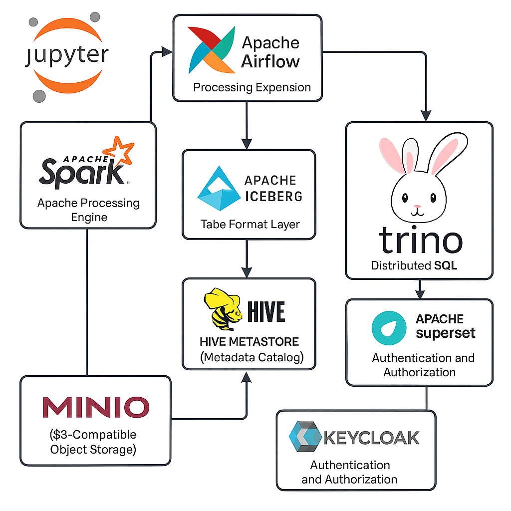

# Modern Data Warehouse Architecture Using Open-Source Technologies

 

 

## Introduction

In today’s data-centric world, enterprises are increasingly reliant on robust and scalable data infrastructure to derive actionable insights from massive and diverse datasets. This modern data warehouse architecture leverages a powerful combination of open-source technologies to deliver a cloud-native, cost-efficient, and highly performant analytics platform. The components include MinIO (S3), Apache Iceberg, Apache Spark, Hive Metastore, Apache Airflow, Trino, Apache Superset, and Keycloak.

## Core Components and Their Roles

### 1. MinIO (S3-Compatible Object Storage)

MinIO acts as the storage layer for raw, curated, and transformed data. It is a high-performance, distributed object store compatible with the S3 API, making it ideal for storing Parquet, Avro, or ORC files accessed by processing and query engines.

### 2. Apache Iceberg (Table Format Layer)

Apache Iceberg provides a high-performance table format that supports ACID transactions, time travel, schema evolution, and partitioning. It interacts seamlessly with object storage and allows analytic engines to operate on large datasets reliably.

### 3. Apache Spark (Data Processing Engine)

Spark is used for batch and streaming data processing. It reads and writes Iceberg tables and performs complex ETL (Extract, Transform, Load) tasks. It integrates with the Hive Metastore for schema and partition information.

### 4. Hive Metastore (Metadata Catalog)

The Hive Metastore serves as the central metadata repository, maintaining schema definitions, table structures, and partition information for Iceberg tables. It enables interoperability across processing and querying tools.

### 5. Apache Airflow (Workflow Orchestration)

Airflow automates and orchestrates data pipelines, including ingestion, transformation, quality checks, and metadata management. It ensures that tasks execute in a well-defined, auditable, and scheduled manner.

### 6. Trino (Distributed SQL Engine)

Trino provides federated querying capabilities and allows analysts to perform interactive SQL queries on Iceberg tables stored in MinIO. It utilizes the Hive Metastore for metadata resolution and schema enforcement.

### 7. Apache Superset (Visualization and BI Tool)

Superset is a lightweight, open-source business intelligence tool that connects to Trino. It offers rich data visualization, dashboarding, and ad hoc exploration capabilities for business users.

### 8. Keycloak (Authentication and Authorization)

Keycloak is an identity and access management solution that integrates with Superset and other services to ensure secure, role-based access to data and workflows.

## Data Flow and Interaction

1. **Data Ingestion**: Raw data is ingested into MinIO using batch uploads, streaming sources, or API integrations.
2. **Processing**: Apache Spark reads data from MinIO, performs transformations, and writes back as Iceberg tables.
3. **Metadata Management**: Updated schemas and partition info are registered in the Hive Metastore.
4. **Orchestration**: Apache Airflow schedules and monitors the entire ETL workflow, ensuring dependencies are maintained.
5. **Querying**: Trino reads Iceberg tables and serves SQL queries for exploration or dashboards.
6. **Visualization**: Superset connects to Trino to visualize query results through dashboards and reports.
7. **Security**: Keycloak governs user authentication and authorization across the ecosystem.

## Conclusion

This open-source architecture delivers a powerful and scalable data warehouse capable of supporting modern analytics workloads. It enables organizations to handle vast volumes of data efficiently, enforce robust governance, and democratize data access through self-service analytics.
